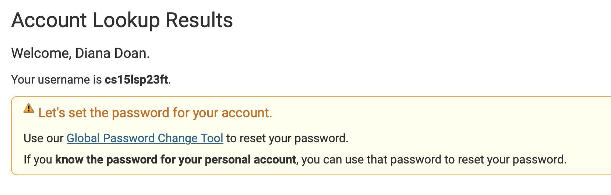
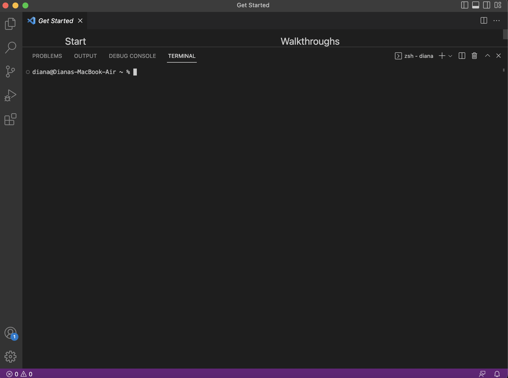
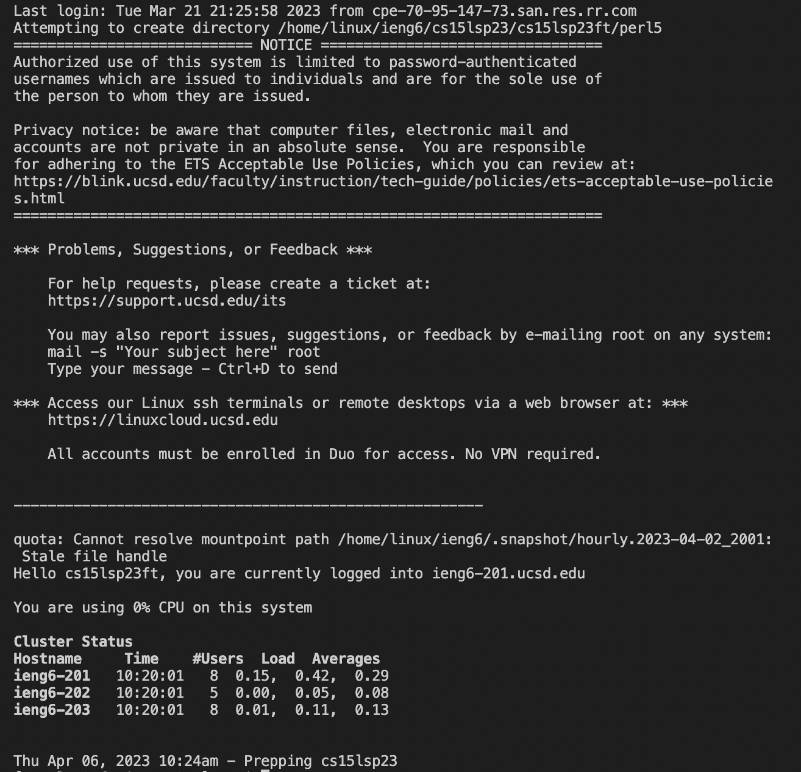
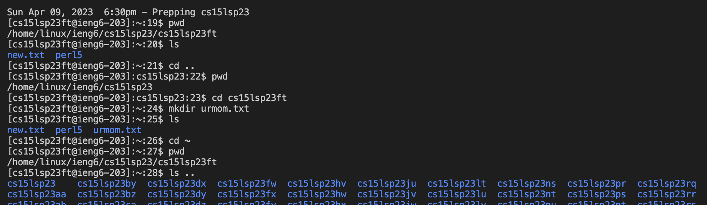
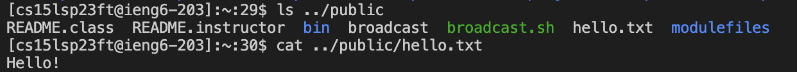

# **Lab Report 1**
---
*Date: 4/6/23*

## ***Purpose:***
The goal of this lab was to introduce ourselves to using SSH, navigating through terminal, and GitHub to creare content. 


## ***Procedure/How did it go?*** 
1. Resetting password for CSE15L account: <br>
 <br>
* Visit the [account lookup](https://sdacs.ucsd.edu/~icc/index.php) to find account and reset password.
* Write the password down somewhere, in case there are issues with logging in later.
<br>

</br>

2. Starting up VSCode and opening a terminal: <br/>
 <br/>
VSCode should already be downloaded on most students' devices, but if not, follow this [link](https://code.visualstudio.com/download) to download. <br/>
After opening up VSCode, navigate to the upper menu Terminal < New Terminal OR use shortcut Ctrl + back-tick (closing apostrophe). 
<br>


</br>

3. Successfully logging into SSH through *ieng6* server (*not sure if this is the right terminology?*): <br>
 <br>
<sub>By using 15L-specific username and reset password, our laptops became the clients of the ieng6 server. The output shows the last login date and other miscellaneous information. <br>
* Type `ssh cs15lsp23__@ieng6.ucsd.edu` into the terminal.
* Type in your password + Enter
* Respond 'yes' + enter to the consequent question and boom!
</sub>
<br>

</br>

4. Exploring different terminal commands: <br/>
Here's a [link](https://www.hostinger.com/tutorials/ssh/basic-ssh-commands) to some useful SSH commands. <br/>

Some commands in practice: <br/>
 <br/>
<sub>*Ends up listing all the student directories in the class (not accesible by non-admin users).*</sub> 
 <br/>

<br>

</br>

5. Creating a GitHub repository and beginning our GitHub journey: <br>
We created our first repositories, created some markdown (md) files, and played around with md shortcuts. Ultimately, this lab report was made using the basic skills introduced by the lab!
<br>

</br>

## ***Conclusion***
At the beginning of the lab, most of the members of the group established that this was the first time we were touching any of this content, outside of VSCode. Some were quick to log-in to SSH, and others took a little longer (mostly as a result of servers closing on their own?). Eventually, we were all playing around with the terminal commands, discovering interesting things about the directories made for the class. GitHub was fun and interesting to get started with. I was awkwardly fumbling around the interface at first, but after some practice, especially through this report, I believe I've gotten down some of the basics of md files. Overall, the lab was a good starter assignment that helped us ease into the class content.

```
## ***Notes (this is not code, just wanted to try the shortcut):***
* explore more md shortcuts (fonts, size, colors, etc.)
* explore more terminal commands
* why were ports being closed?
* no way to organize files in github?
* resize images?
```
---
