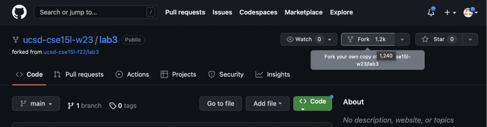
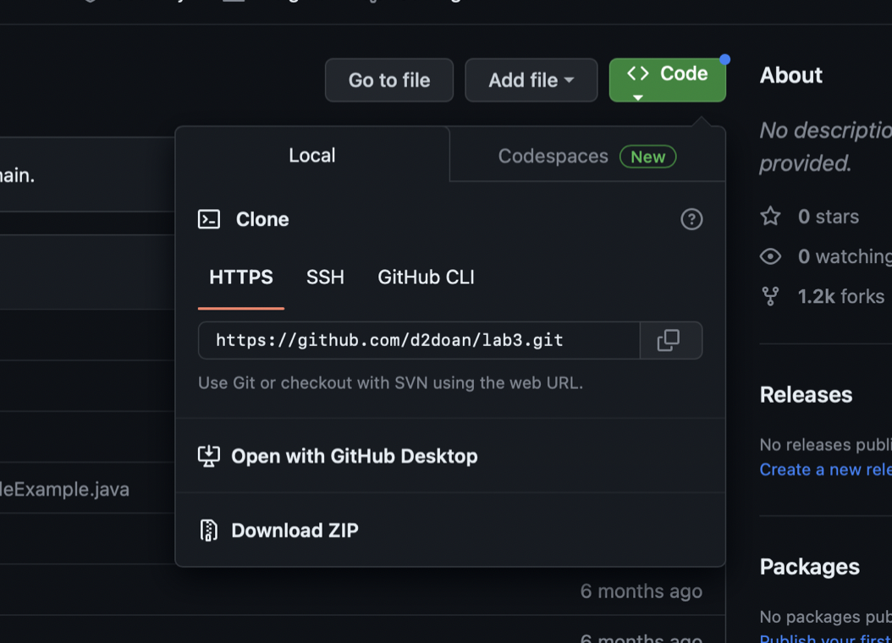
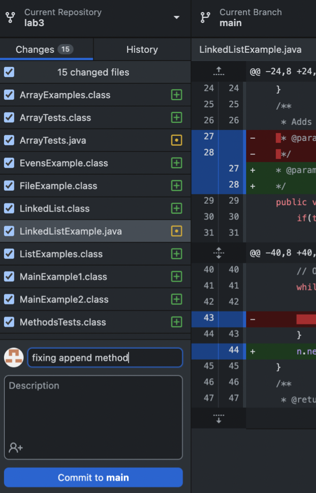
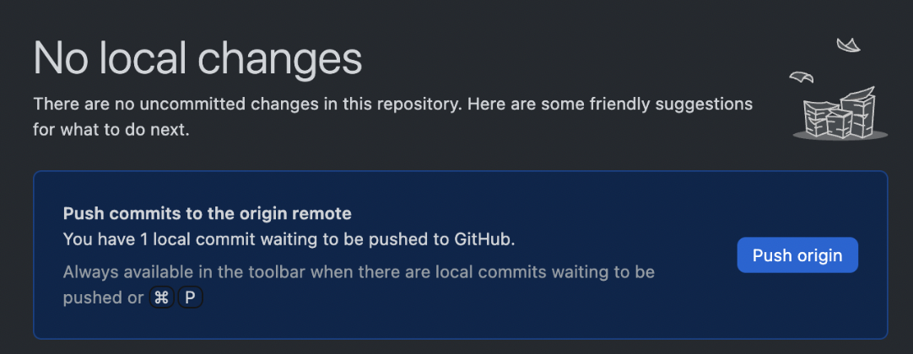
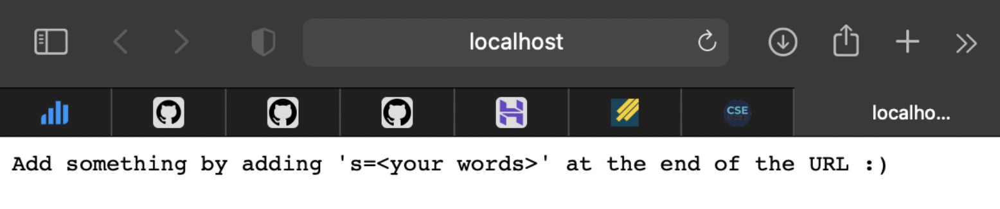
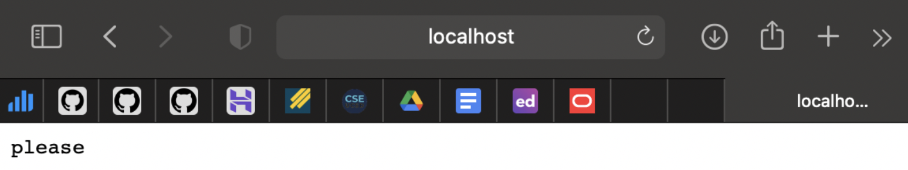
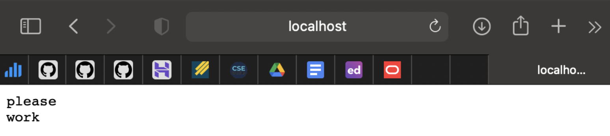
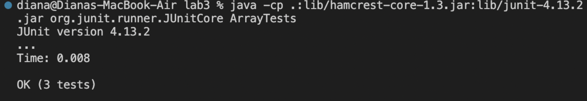
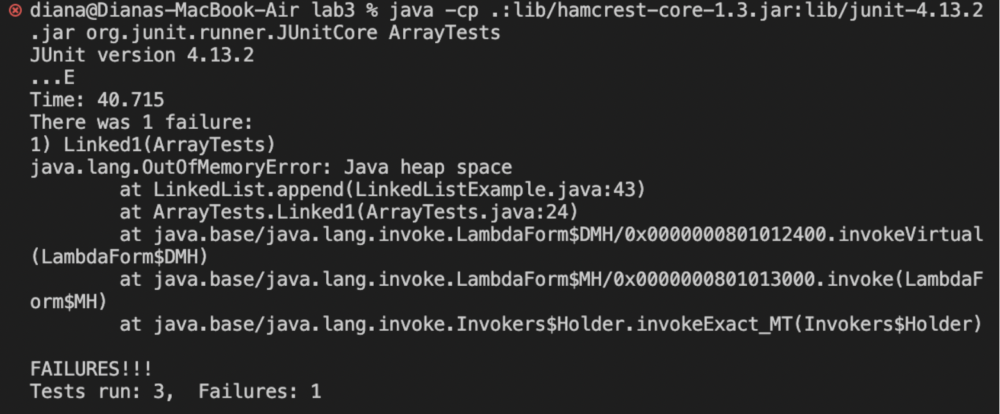
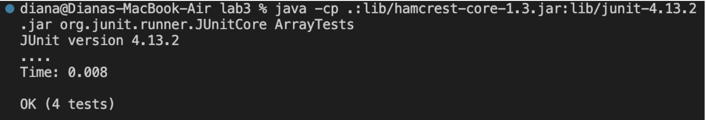

# **Lab Report 2**
---

## ***Purpose***
Experiment with jUnit by debugging code, and explore web servers.

## ***Procedure/How Did It Go?***

First things first, how to take a repository and play with it: <br/>
Make a fork of [this](https://github.com/ucsd-cse15l-w23/lab3) repository to access the files for the lab. <br/>
<br/>

  
  
Download [GitHub Desktop](https://desktop.github.com) and sign in with GitHub account. <br/>
Navigate to your copy of the repository if it is not already open, then “Open with GitHub Desktop”: <br/>

<br/>
<br>
<br>
In Github Desktop -> “Open in Visual Studio Code”. Now, you can edit the files and run code as usual.
After changes are made to your files, “Commit to main” -> “Push origin” in GitHub DeskTop to reflect changes to your repository: <br/>

<br/>

---

### ***Part 1***
*The code in StringServer.java:* <br/>
```
import java.io.IOException;
import java.net.URI;

class Handle implements URLHandler{
   String str = "";
  
   public String handleRequest(URI url){
       String str2 = str;
       if(url.getPath().equals("/add-message")){
           if(url.getQuery().contains("s=")){
               String[] quer = url.getQuery().split("=");
               str = quer[1]+ "\n";
               return str2 + str;
           }
       }
       return "Add something by adding 's=<your words>' at the end of the URL :)";
   }
}

class StringServer {
   public static void main(String[] args) throws IOException {
       if(args.length == 0){
           System.out.println("Missing port number! Try any number between 1024 to 49151");
           return;
       }
       int port = Integer.parseInt(args[0]);
       Server.start(port, new Handle());
   }
}
```
After compiling Server.java and StringServer.java, testing `java StringServer 1500` in terminal produced a link to a web server. Opening it up resulted in the image below, with the default message I set in the code above:<br/>
<br/>
  
Changing the path and query in the address bar by adding `/add-message?s=please` resulted in:<br/>
  
<br/>
  
Notes about this:<br/>
The link looks like this - http://localhost:1500/add-message?s=please <br/>
<br>
Methods called (some in other files, not visible in code snippet above):<br/>
StringServer.main(), Handle.handleRequest(), Server.start(), ServerHttpHandler.handle() <br/>
<br/>
Arguments:
* main(1500) 
* Handle.handleRequest(new URI(http://localhost:1500/add-message?s=please))
* Path: /add-message
* Query: ?s=please
* Server.start(1500, new Handle())
* String str = “please\n” <br/>

The only relevant field that is changed is the str field (and technically, the str2 field in the handleRequest method), as it collects the desired words to concatenate to the list.<br/>
    
<br/>


Next, changing the query to add a new word: <br/>

  
Notes about this:<br/>
    The link looks like this - http://localhost:1500/add-message?s=work <br/>
    <br>
    Methods called:<br/>
    Handle.handleRequest() <br/>
    <br>
    Arguments:
* main(1500), 
* Handle.handleRequest(new URI(http://localhost:1500/add-message?s=work))
* Path: /add-message
* Query: ?s=work
* Server.start(1500, new Handle())
* String str = “work\n” <br/>

The str field is changed to the next desired phrase to concatenate, “work,” by assigning the second value of the split query to str. <br/>


### ***Part 2***
Input that did work:<br/>
```
 @Test
 public void Linked2(){
   LinkedList l = new LinkedList();
   l.append(3);
   l.append(6);
   assertEquals("3 6 ", l.toString());
 }
```
Output:<br/>
<br/>
  
Input that did not work:<br/>
```
@Test
 public void Linked1(){
   LinkedList l = new LinkedList();
   l.append(3);
   l.append(4);
   l.append(20);
   l.prepend(1);
   assertEquals("1 3 4 20 ", l.toString());
 }
```
Output:<br/>
<br/>
    Respective Failure in LinkedList.append():<br/>
*The OutOfMemoryError is basically saying that Java has run out of space to hold all the values that it is being asked to hold, which implies that there is an infinite loop somewhere in LinkedList.append().*<br/>
<br/>

To fix the method, I just pulled the last line within the while loop, outside, so the method doesn’t keep adding Nodes to the linked list.<br/>
*This is the result after running the same input through the corrected code.*<br/>
<br/>
<br/>
  
Old method: <br/>
```
   public void append(int value) {
       if(this.root == null) {
           this.root = new Node(value, null);
           return;
       }
       // If it's just one element, add if after that one
       Node n = this.root;
       if(n.next == null) {
           n.next = new Node(value, null);
           return;
       }
       // Otherwise, loop until the end and add at the end with a null
       while(n.next != null) {
           n = n.next;
           n.next = new Node(value, null);
       }
   }
```

Fixed method: <br/>
```
   public void append(int value) {
       if(this.root == null) {
           this.root = new Node(value, null);
           return;
       }
       // If it's just one element, add if after that one
       Node n = this.root;
       if(n.next == null) {
           n.next = new Node(value, null);
           return;
       }
       // Otherwise, loop until the end and add at the end with a null
       while(n.next != null) {
           n = n.next;
       }
       n.next = new Node(value, null);
   }
```
Essentially, the fix was to stop adding nodes (of the same value) to the end of the linked list and instead, find the last node, exit the while loop, and add the new node to the last one. <br/>

---
### ***Part 3 (Reflection)***
Prior to a couple of lectures ago, I had no clue you could start a server from the command line. Then, in the week 2 lab, I learned that you could update the content in the web server by implementing methods that interpret given paths and queries given to the address bar. At first, even though all the necessary methods were there, I kept trying to manipulate the web server content through the VSCode terminal, but eventually, I realized the point of using the URI method calls in our Handler method was to make changes directly in the server. As for jUnit, we're already using it heavily in CSE 12, so it isn't entirely new to me, but it's nice to see familiar tools appear in this class. The content covered in the last two weeks has been very handy and cool. 
  
