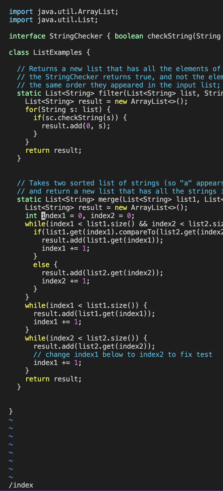
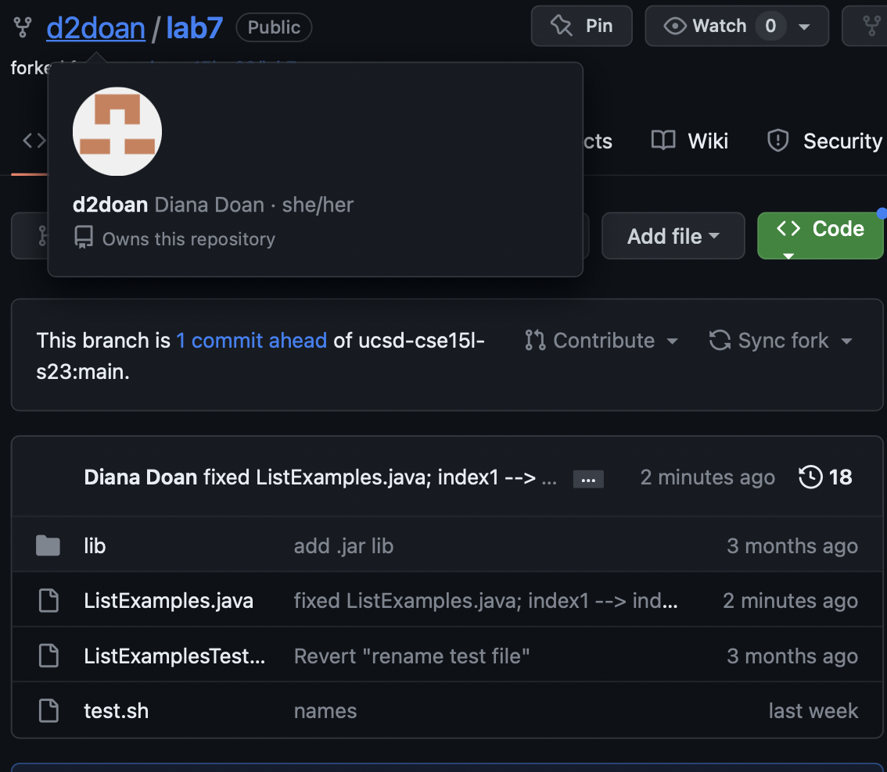

# Lab Report 4
___
*Date: 5/18/23*

## **Purpose:**
To explore and practice commands in terminal, using vim to edit and manipulate text/code, and interact with GitHub through git. 

## **Procedure/How Did It Go?**
Log into your student account via ieng6. After setting up an SSH key, the log-in process should be fairly quick. 
 
If you need a reminder, to login via SSH, type **`ssh cs15lsp23__@ieng6.ucsd.edu`** in your terminal and press `enter` until you are successfully in your student account. 
 

Assuming the https://github.com/ucsd-cse15l-sp23/lab7 repository is forked into your personal GitHub account, run the command **`git clone git@github.com:yourUser/lab7.git`** + **`<enter>`**.  
(obviously, replace 'yourUser' with your GitHub username)  
 

If you're still in the home directory of your student account, navigate to the lab7 directory by typing **`cd lab7`**+ **`<enter>`**.  

Now that you're in the directory that contains the code we want to run, type **`bash test.sh`** + **`<enter>`**, to run the bash file that compiles and runs tests on ListExamples. 
 
> The result should look something like this: 
  
  
The jUnit test results tell us that there seems to be a bug in the ListExample.java file, so in order to edit the file in command line, type **`vim ListExamples.java`** + **`<enter>`**. This will open the file in an in-terminal text editor.  
 
 

### ***Now that we're in vim...***
___
Without typing, the initial mode will be normal mode.  
 

Still in normal mode, and without worrying about the cursor, just type **`/index1`** + **`<enter>`** to navigate to the first occurence of 'index1' in the code. This isn't the instance we want to edit, so press **`n`** 9 times (or however many times it takes to get to the line directly under the comment).  
 
 

Type **`e`** (takes you to the last character of the word your cursor is on), 
then, type **`a`** (enters insert mode and moves the cursor one character to the right). 
 

*OR*
 

From the initial normal mode, use up, down, left, right keys (`k`, `j`, `h`, `l`, respectively) to navigate to the line that needs fixing. Then, simply type `i` to enter insert mode. 
*Note: These options DO NOT need to be followed by `<enter>`*.  

 

After using either method, we're now in insert mode and are able to make changes to the text. Simple press **`<backspace>`** + **`2`** to change 'index1' to 'index2'. The code is now corrected. Re-enter normal by pressing `<escp>`.  

***Before you exit vim completely, save your work by typing `:w`, then finally, `:q` to quit vim.*** 
Alternatively, you can use :wq to save and quit at once. 

 
 

The code is now fixed, so to test that it in fact works, run the test.sh again in terminal (**`bash test.sh`**). Your output should now look like this: 
 
 
Observe the result of the bash command near the bottom of the picture.

 

### ***Onto commitment...***
___
In order to update the ListExample.java file in your GitHub repository, you still need to commit and push. 

 
Because your GitHub account should be associated to your student account via an SSH key that you should've set up earlier, committing will only require the following steps: 
 

Type `git add ListExamples.java` + `<enter>` to add ListExamples.java to the GitHub stage  
 
 
 
 

Type `git commit -m "[a useful message to describe the change]"` + `<enter>` to commit (duh)  
 
 
 
 

Type `git push` + `<enter>` to officially push your changes to the repository (yay!)  
 
 
 
 
  
> In addition, you can use `git status` to see what your stage/workspace currently looks like, or `git log` to see the commit history of your repository.

 
In the end, when you check your GitHub repository, you should see the change in your ListExample.java file along with your commit message: 
 
 
Take note of the commit message given next to the title of the file that was changed. This works kind of as proof that the changes went through successfully, while also giving insight to the changes made. 
 
 

## **Reflection**
___
Though pretty simple, this lab helped to warm up to both vim and git commands, that can make programming more efficient. The ideas covered in this lab were mainly vim's insert and normal mode, vim options (`e`, `a`, `j`, `k`, `h`, `l`), and the overall pipeline between git and vim in terminal and the GitHub platform. These functions work similarly to GitHub Desktop, and their uses can almost be interchangeable, although editing in command-line may save some time (and be a tad more versatile). There is a *lot* more to explore in regards to vim and git, so this was a good start and base.

