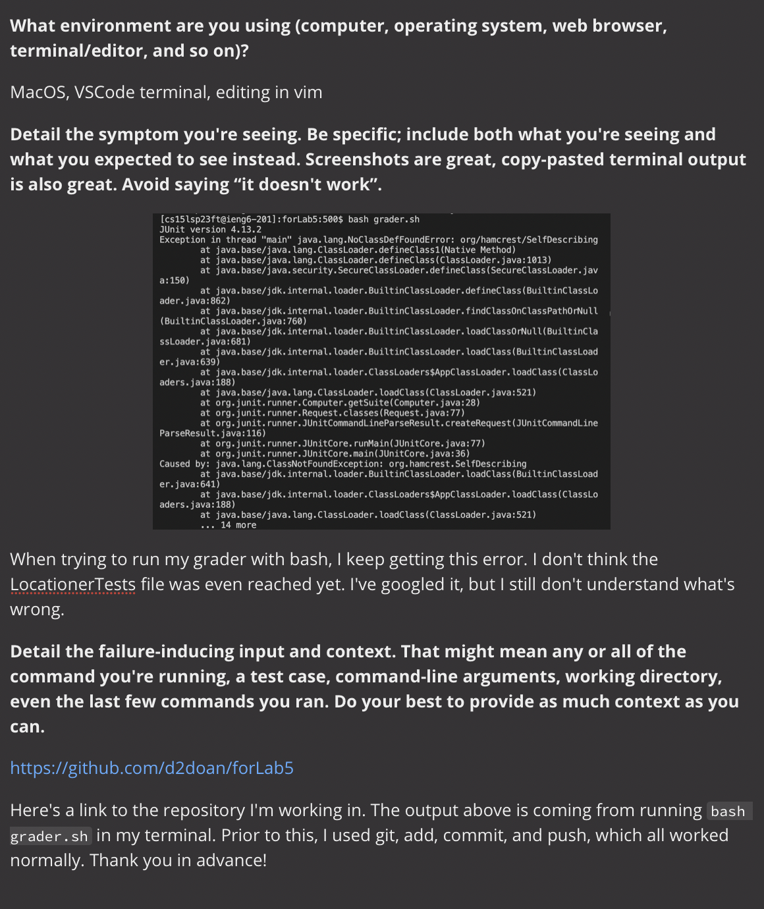
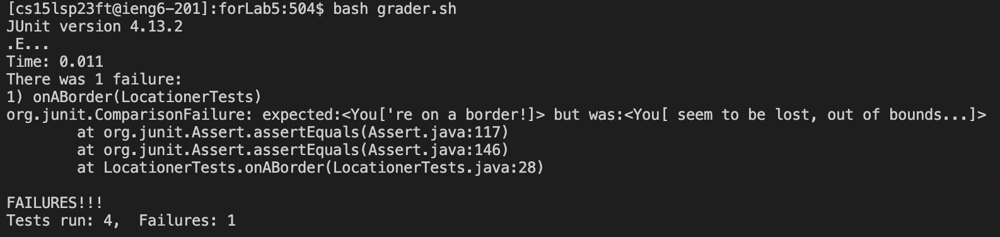

# ***Lab Report 5***
___
*Date: 6/1/2023*

## ***Purpose:***
To replicate a TA-student interaction, then reflect on the content of the class.  

---

### ***Part 1 (Scenario)***
*Note: TA response is italicized, student is bolded. 
(Link to the student's [repository](https://github.com/d2doan/forLab5)) 

  
 
*TA: NoClassDefFoundError usually means java is having a hard time finding a file you're specifying. Most likely, you're using a classpath somewhere that isn't entirely right. The following lines of the error output look like they're not concerned about your actual java files, so I suggest looking at your grader.sh file for bugs.*  
  

**Student: Can you explain what you mean by "classpath?" I'm still a little confused by the output.**  
  
*TA: Classpath essentially means the path that java uses to find your desired file within a directory/folder. In this case, you should check what classpath you're telling java to follow in order to find hamcrest-core-1.3.jar. Hope this helps!*  
  
  
**Student: I forgot to include the parent foler "lib" before hamcrest in my grade.sh file. Silly mistake. I got the failure that was *supposed* to happen after fixing the bug (I was mimicking a logic error). Thanks for the help!!**  
  

*TA: Of course! But please be sure to eventually fix the logical error in your Locationer.java file as well...*  
  
  
 
*--Thread Resolved--*  

___

### ***Part 2 (Reflection)***
In terms of technical knowledge, I've learned a lot of neat tricks from being in labs. Learning how to use tools like vim, bash, and servers in class is useful, but learning how to use them more efficiently came from labs, where we explored a lot of shortcuts (mostly from the internet) to imitate a real working environment. Particularly, I *actually* enjoy using vim. I always saw the memes on r/ProgrammerHumor and couldn't relate, but now that I've learned a little about it, I can have a real opinion on it. It feels safe somehow, since it doesn't require any extra software. It also makes using bash a lot quicker, since it all happens in terminal.  

In addition, I imagine using git on the command line to create repositories (or turn existing directories into repositories, like I did for this lab) will prove to be very useful in the near future. Folders acting as both directories and repositories is an interesting idea that I was happy to investigate through the last few labs :).   
